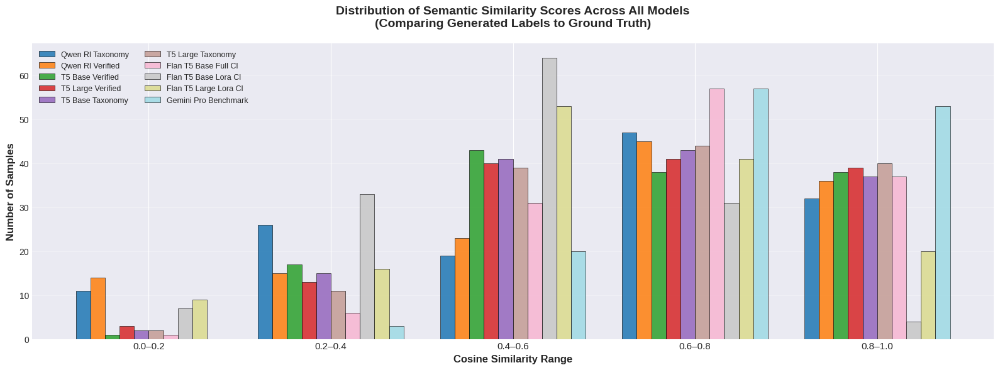
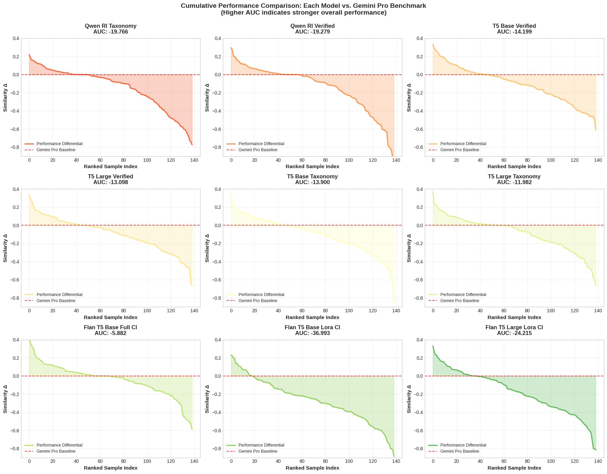

# Fine-tuning Language Models for Automated Topic Labeling

Topic modeling models produce lists of keywords. This task typically requires an additional step—topic labeling—to generate meaningful label strings. In previous work predicting future trends from scientific literature, we relied on the ChatGPT API for topic labeling. However, this approach is uncontrollable and prone to hallucinations and model bias. This paper investigates how different language models can be engineered to automate this task effectively.

## Experiment 0: Comparing LLMs on Topic Labeling

In this experiment we evaluate six prominent LLMs (GPT-4, Claude, Perplexity, Gemini Pro, Grok, and DeepSeek) by comparing their topic labeling capabilities on a reference dataset of 67 expert-verified topics from our research group’s previous work (`Previously Labeled Dataset`) , where each topic comprised 8 representa- tive keywords and a validated topic label assigned through ChatGPT API and subsequently verified by domain expert supervisors. For each topic, we generated labels using identical prompts
across all six models to ensure fair comparison. To quanti-
tatively assess semantic alignment between generated labels
and source keywords, we employed the SPECTER model, a Transformer-based scientific document encoder trained
on citation graphs. SPECTER was selected for its superior
performance on scientific text, aligning with our use case.
We embedded both topic keywords and generated labels
using SPECTER, then computed cosine similarity between
keyword embeddings and label embeddings for each model.
Results demonstrated that Grok achieved the highest mean
similarity (0.887), followed closely by Gemini Pro (0.885), Perplexity
plexity (0.883), Claude (0.881), GPT-4 (0.878), and DeepSeek
(0.873). While Grok marginally outperformed other models, Gemini Pro followed as a close second with a negligible
performance difference. Consequently, we selected Gemini Pro
for subsequent data generation due to its seamless integration
with Google Sheets through AI-generated columns, facilitating
efficient large-scale dataset creation.

## Experiment 1: T5 Mini Fine-tuning

In this experiment, we investigated whether T5 (Seq2Seq Encoder-Decoder architecture) would be suitable for our problem. We used the `Previously Labeled Dataset` to fine-tune three T5 variants (small, base, and large) and manually evaluated their outputs. The goal was to determine whether T5 could generate labels in the desired format: 2–6 words with a title-like structure. Since the topic pairs fell within our supervisors' research expertise, we asked them to evaluate the fine-tuned model outputs. Our supervisors found T5-base and T5-large to be promising and acceptable, while T5-small was deemed insufficient for this task because it primarily reproduced input keywords. Consequently, we proceeded with T5-base and T5-large in subsequent experiments.

#### Methodology

**Dataset Preparation and Augmentation**

Topic keywords and labels were extracted from the Previously Labeled Dataset and split into training (85%) and validation (15%) sets using stratified random splitting with random seed 42 for reproducibility. The training dataset was augmented using three stochastic techniques applied during training iterations: (1) word order shuffling applied with 50% probability to prevent positional bias, (2) random word dropping (30% probability) for words beyond the threshold of 3 keywords to simulate variable topic sizes, and (3) semantic context preservation to maintain topic coherence during augmentation.

**Semantic Context Formation**

Rather than using minimal input formats, we employed rich semantic prompts to guide model understanding. The input encoding uses the template: `"Generate a concise topic label that describes the main theme of these keywords: [keyword1, keyword2, ...]"` This template was dynamically selected from a pool of semantically equivalent templates to introduce variety during training while maintaining semantic consistency.

**Model Architecture and Training Configuration**

Three T5 model variants were employed: T5-small, T5-base, and T5-large. To mitigate catastrophic forgetting of pre-trained semantic knowledge, the first 4 encoder layers were frozen during fine-tuning, preserving the model's underlying linguistic representations. The decoder and 8 remaining encoder layers were fine-tuned using AdamW optimizer with:

- Learning rate: 5e-5 (conservative to preserve pre-training)
- Weight decay: 0.01 (L2 regularization)
- Batch size: 8 samples per iteration
- Gradient clipping: maximum norm of 1.0 to prevent exploding gradients
- Linear learning rate scheduler with 10% warmup steps

**Data Processing Pipeline**

Input sequences (topic keywords) were tokenized to maximum length 128 tokens with padding and truncation. Target sequences (labels) were tokenized to maximum length 32 tokens. Padding token IDs in labels were masked with -100 to be ignored by the cross-entropy loss function, ensuring only valid label tokens contribute to gradient computation.

**Generation Parameters for Inference**

Prediction generation employed beam search (num_beams=5) with several constraints to prevent copying input keywords and word repetition:

- Repetition penalty: 2.0 (strongly discourages repeating tokens)
- No-repeat n-gram size: 2 (prevents bigram repetition)
- Temperature: 1.0 (deterministic generation via beam search)
- Top-k filtering: 50 (nucleus sampling parameter)
- Top-p filtering: 0.95 (nucleus sampling cumulative probability)
- Minimum length: 2 tokens, Maximum length: 32 tokens
- Early stopping enabled for beam search

**Training Procedure**

Models were trained for up to 15 epochs with early stopping based on validation loss. Validation was performed after each epoch on the held-out validation set (15% of data). Early stopping was triggered if no improvement in validation loss was observed for 7 consecutive epochs. The best model checkpoint (lowest validation loss) was preserved throughout training. Training history including epoch-wise train and validation losses was logged in JSON format for post-hoc analysis.

## Expert Validation Study

#### Hypothesis and Experimental Design

We formulated the hypothesis: _LLMs can generate high-quality topic keyword-label pairs for specific research fields with expert-level accuracy._ To test this hypothesis rigorously, we designed a comprehensive validation study involving domain experts.

We recruited 35 PhD holders from The German University in Cairo spanning 8 faculties: Media Engineering and Technology, Information Engineering and Technology, Engineering and Materials Science, Pharmacy and Biotechnology, Management Technology, Applied Sciences and Arts, Mathematics, and Physics. For each expert, we identified 3–6 research specializations based on their public research profiles (e.g., Google Scholar, ResearchGate).

#### Data Generation Protocol

For each unique research field identified, we employed Gemini to generate 7 topic keyword-label pairs using a carefully designed prompt:

```
You are an expert research scientist with deep focus on [Research Field]. Generate 7 unique (topic_words, topic_label) pairs relevant to this field. Guidelines: (1) topic_words must be a JSON list of 5 lowercase single-word strings representing highly related keywords from an LDA topic model. (2) topic_label must be a concise string (2–5 words) accurately summarizing the topic_words. Output as valid JSON.
```

This prompt structure was designed to elicit focused, domain-relevant pairs while maintaining consistency in format and granularity.

#### Validation Protocol

We developed a web-based survey platform where experts evaluated pairs from their assigned research fields. For each pair, participants voted "Agree" or "Disagree" based on whether the keywords and label accurately represented a coherent research topic. To ensure data quality, we embedded trap questions—pairs intentionally designed to elicit disagreement from careful evaluators. Participants who voted "Agree" on all pairs without discrimination were flagged and excluded from analysis.

#### Statistical Analysis

Of 931 evaluated pairs, 812 received "Agree" votes, yielding an agreement rate of 87.22%. A one-sample proportion z-test confirmed this rate significantly exceeded the random chance baseline (50% for binary votes; $p < 0.001$).

## Dataset Construction

### Verified Dataset

The validated expert survey yielded our first dataset. After filtering pairs that received "Disagree" votes and excluding responses from participants who failed trap questions, we retained 812 high-quality pairs. This **Verified Dataset** represents expert-validated, domain-specific topic labels spanning diverse scientific fields with confirmed accuracy.

### Taxonomy Dataset

To achieve broader coverage across scientific disciplines, we leveraged Elsevier's Digital Commons Three-Tiered Taxonomy of Academic Disciplines. This comprehensive taxonomy organizes knowledge into hierarchical levels: broad disciplines, subdisciplines, and specific research fields.

We targeted the third tier, comprising 913 specific research fields (e.g., Physical Sciences and Mathematics → Computer Sciences → Software Engineering). Using Gemini with the same prompt structure employed in the validation study, we generated 7 topic keyword-label pairs per field. Two fields ("Holocaust and Genocide Studies" and one other) were excluded because Gemini declined generation due to ethical safeguards, resulting in 911 fields. This process produced 6,377 topic keyword-label pairs spanning the breadth of academic research, constituting our **Taxonomy Dataset**. While not expert-validated, this dataset provides extensive coverage and diversity, complementing the focused accuracy of the Verified Dataset.

## Fine-tuning

### Experiment 2: Partial Fine-tuning T5 Using Transfer Learning

This experiment investigates the impact of dataset composition and model scale on T5 fine-tuning for topic labeling. Two model variants (T5-base and T5-large) were fine-tuned on two distinct datasets (Verified Dataset and Taxonomy Dataset) following a systematic transfer learning approach.

#### Methodology

**Model Configuration and Partial Fine-tuning Strategy**

Two T5 model architectures were employed: T5-base (220M parameters) and T5-large (770M parameters). Following the transfer learning approach established in Experiment 1, the encoder architecture was partially frozen to preserve pre-trained semantic knowledge while allowing task-specific adaptation:

- First 4 encoder layers: frozen (immutable during training)
- Remaining 8 encoder layers: trainable
- Decoder: fully trainable
- Total trainable parameters: approximately 50-60% of model parameters

**Tokenization and Sequence Length Configuration**

Input sequences (topic keywords formatted with semantic prompts) were tokenized with:

- Maximum source length: 128 tokens
- Padding and truncation: enabled
- Padding strategy: `max_length` with post-padding

Output sequences (topic labels) were tokenized with:

- Maximum target length: 32 tokens
- Padding and truncation: enabled
- Padding strategy: `max_length` with post-padding
- Masked label padding: padding token IDs replaced with -100 to exclude them from loss computation

**Optimization Configuration**set to

The training optimization pipeline utilized:

- **Optimizer**: AdamW with filtered parameter groups (only unfrozen parameters)
- **Learning rate**: 5e-5 (conservative setting to preserve pre-trained weights)
- **Weight decay**: 0.01 (L2 regularization for weight decay)
- **Batch size**: 1 sample per iteration (memory-constrained setting for large models)
- **Gradient clipping**: maximum norm of 1.0 to prevent exploding gradients
- **Learning rate scheduler**: Linear schedule with warmup
  - Warmup steps: 10% of total training steps
  - Total training steps: computed from epoch count and batch size

**Data Augmentation Strategy**

Training data augmentation was applied stochastically:

- Word order shuffling: 50% probability per sample
- Word dropout: 30% probability (drops one word if more than 3 words present)
- Semantic context sampling: input prompts randomly selected from equivalent template pool during batch creation

Validation data was processed without augmentation.

**Training Loop and Early Stopping**

Training was conducted for a maximum of 15 epochs with the following monitoring and stopping criteria:

- Epoch-wise training loss computation over the entire training set
- Epoch-wise validation loss computation on the held-out validation partition
- Early stopping trigger: no improvement in validation loss for 7 consecutive epochs
- Model checkpointing: best model (lowest validation loss) automatically saved
- History logging: epoch-wise train and validation losses recorded in JSON format

**Generalization Across Models and Datasets**

The experiment follows a cross-product design:

- **Model variants**: T5-base and T5-large (2 configurations)
- **Dataset variants**: Verified Dataset and Taxonomy Dataset (2 configurations)
- **Total training runs**: 4 independent fine-tuning sessions, each initialized with the same hyperparameters and architecture decisions

### Experiment 3: Fine-tuning Qwen using Reinforcement Learning

This experiment investigates reinforcement learning-based fine-tuning for topic labeling using the Qwen2.5-3B-Instruct model with GRPO (Gradient Reward Policy Optimization). Two datasets (Verified Dataset and Taxonomy Dataset) are employed to train models with identical hyperparameters and architectural configurations.

#### Methodology

**Model Architecture and Parameter-Efficient Fine-tuning**

The Qwen2.5-3B-Instruct model was loaded in 4-bit quantization mode to reduce memory overhead while maintaining training fidelity. Low-Rank Adaptation (LoRA) was applied as the parameter-efficient fine-tuning mechanism with the following configuration:

- **LoRA rank (r)**: 64 (controls the dimensionality of the low-rank decomposition)
- **LoRA alpha (lora_alpha)**: 64 (scaling factor for LoRA layer influence on model outputs)
- **Target modules**: Query projections (q_proj), Key projections (k_proj), Value projections (v_proj), Output projections (o_proj), Gate projections (gate_proj), Up projections (up_proj), Down projections (down_proj)
- **Gradient checkpointing**: Enabled with "unsloth" backend for memory-efficient training on long contexts
- **Maximum sequence length**: 1024 tokens
- **GPU memory utilization**: 50% (configurable to prevent out-of-memory errors)
- **Random seed**: 3407 (for reproducibility)

**Reward Function Design and Computation**

Three complementary reward functions were implemented to provide multi-faceted optimization signals:

1. **Embedding Similarity Reward Function**:
   - Utilized all-MiniLM-L6-v2 sentence transformer for encoding both generated and expected labels into dense vector representations
   - Computed cosine similarity between generated and expected label embeddings using sklearn.metrics.pairwise.cosine_similarity
   - Output range: [0, 1], representing semantic alignment between generated and target labels
   - Model-agnostic approach captures semantic equivalence rather than exact string matching

2. **Length Penalty Reward Function**:
   - Applied penalty for outputs exceeding expected label length by more than 2 words
   - Penalty computation: $-0.1 \times \frac{\text{generated\_len} - \text{expected\_len} + 2}{\text{expected\_len}}$ for oversized outputs
   - Penalty capped at -0.5 to prevent excessive negative signals
   - Encourages brevity while allowing reasonable variation in output length

3. **Combined Reward Function**:
   - Weighted combination of embedding similarity (80% weight) and length penalty (20% weight)
   - Formulation: $R_{\text{combined}} = 0.8 \times R_{\text{similarity}} + 0.2 \times R_{\text{length}}$
   - Balances semantic correctness with output brevity

**Input Prompt Design**

A system prompt was used to frame the task:

```
You are an expert at analyzing research topics and generating concise, descriptive labels.
Given a set of keywords and a research field, generate a clear and relevant topic label
that captures the essence of the topic. Provide only the topic label without any additional explanation.
```

User prompts were formatted as:

```
Topic Keywords: [comma-separated keywords]
Research Field: [field name]
```

This two-part prompt structure (system role definition + task specification) guides the model toward focused label generation.

**GRPO Trainer Configuration**

The Gradient Reward Policy Optimization trainer was configured with the following hyperparameters:

- **Learning rate**: 5e-6 (conservative to preserve instruction-following ability from pre-training)
- **Optimizer**: AdamW 8-bit (memory-efficient variant)
- **Adam parameters**: β₁ = 0.9, β₂ = 0.99 (standard momentum parameters)
- **Weight decay**: 0.1 (L2 regularization to prevent overfitting)
- **Learning rate schedule**: Cosine annealing with 10% warmup ratio
- **Precision**: bfloat16 if supported, otherwise fp16 (mixed precision training)
- **Per-device batch size**: 1 (single sample per training step)
- **Gradient accumulation steps**: 1 (no gradient accumulation; update applies per step)
- **Gradient clipping**: maximum norm of 0.1 (aggressive clipping to stabilize RL training)

**Generation Configuration During Training**

During the RL training loop, the model generates multiple candidate completions per prompt:

- **Number of generations per prompt**: 8 (generates 8 alternative labels per input)
- **Maximum prompt length**: 256 tokens
- **Maximum completion length**: 100 tokens (shorter than typical language modeling tasks)
- **Sampling strategy**: Beam search with deterministic decoding for consistency

These 8 generations provide diverse samples for the reward functions to evaluate, enabling the model to learn from comparative feedback.

**Training Procedure and Logging**

Training was conducted with:

- **Total training steps**: Equal to the number of samples in the dataset (one pass through data)
- **Model checkpointing**: Saved every 250 training steps
- **Logging frequency**: Every training step
- **Merge strategy**: LoRA adapters merged into the base model after training for inference
- **Model persistence**: Quantization-aware merged model and tokenizer saved to file

**Cross-Dataset Training**

The experiment was replicated with identical hyperparameters and architectural configuration across the two datasets. Both training runs used the same GRPO framework and reward functions, enabling direct comparison of how dataset composition affects reinforcement learning-based fine-tuning for topic labeling.

### Experiment 4: Full Fine-tuning Flan T5 using Curriculum Learning

This experiment employs a two-phase curriculum learning strategy to fine-tune FLAN-T5-Base (250M parameters) for topic labeling. The approach progressively trains on data of increasing quality: first on a larger silver dataset (Taxonomy Dataset) to establish general patterns, then refines on a smaller gold dataset (Verified Dataset) to improve semantic accuracy.

#### Methodology

**Model Architecture and Full Fine-tuning Strategy**

FLAN-T5-Base, an instruction-tuned encoder-decoder Transformer model with 250M parameters, was fully fine-tuned without frozen layers. Unlike previous experiments employing parameter-efficient techniques (LoRA) or partial freezing, this approach fine-tunes all model parameters to allow maximum adaptation to the topic labeling task while leveraging instruction-tuning knowledge built into FLAN-T5.

**Tokenization Configuration**

Inputs and targets were tokenized with the following specifications:

- **Input sequences (topic keywords + research field)**: Maximum length 128 tokens with padding and truncation enabled
- **Target sequences (topic labels)**: Maximum length 32 tokens with padding and truncation enabled
- **Padding strategy**: Dynamic padding via DataCollatorForSeq2Seq to pad to the longest sequence in each batch (with 8-token multiple alignment)
- **Special token handling**: Padding token IDs in labels masked with value -100 to exclude from loss computation

**Input Prompt Template**

Inputs were formatted using a consistent template:

```
Generate a concise topic label for the following.
Research field: [research_field]
Keywords: [topic_words]
Topic label:
```

This three-line structure provides explicit task instructions paired with structured input information.

**Phase 1 — Silver Data Pre-training Configuration**

Phase 1 trains on the larger Taxonomy Dataset (~6,300 rows) to establish foundational patterns:

- **Learning rate**: 3e-4 (higher to enable faster initial learning)
- **Optimizer**: AdamW (8-bit variant for memory efficiency)
- **Weight decay**: 0.01 (L2 regularization)
- **Batch size**: 16 samples per device
- **Training epochs**: 5 (limited to avoid memorization on silver data)
- **Learning rate scheduler**: Cosine annealing schedule
  - Warmup steps: 6% of total training steps
  - Total steps: computed from dataset size, batch size, and epoch count
- **Mixed precision**: FP16 enabled on CUDA-capable GPUs
- **Label smoothing**: 0.1 (moderate smoothing to regularize)
- **Gradient accumulation**: 1 step (no accumulation)
- **Evaluation strategy**: Every ½ epoch (twice per epoch)
- **Early stopping**: Patience of 3 evaluation steps without improvement in cosine similarity

The Phase 1 validation set consists of 5% of the Taxonomy Dataset, held out for monitoring convergence. A separate gold validation set (20% of Verified Dataset) is also evaluated at each checkpoint to track transfer performance.

**Phase 2 — Gold Data Fine-tuning Configuration**

Phase 2 fine-tunes the best Phase 1 checkpoint on the smaller Verified Dataset (~650 training rows) to refine semantic accuracy:

- **Learning rate**: 1e-4 (reduced by 3× to prevent catastrophic forgetting)
- **Optimizer**: AdamW (8-bit variant)
- **Weight decay**: 0.01 (L2 regularization, unchanged)
- **Batch size**: 16 samples per device (identical to Phase 1)
- **Training epochs**: 15 (extended to fully leverage high-quality data)
- **Learning rate scheduler**: Cosine annealing schedule
  - Warmup steps: 10% of total training steps
  - Total steps: computed from gold dataset size, batch size, and epoch count
- **Mixed precision**: FP16 enabled
- **Label smoothing**: 0.05 (lighter smoothing on gold data)
- **Gradient accumulation**: 1 step
- **Evaluation strategy**: Every epoch (once per epoch)
- **Early stopping**: Patience of 3 evaluation steps without improvement in cosine similarity

The Phase 2 validation set consists of 20% of the Verified Dataset, held out from training.

**Evaluation Metric — Embeddings-based Cosine Similarity**

Rather than exact-match or loss-based metrics, cosine similarity was used throughout training to directly measure semantic alignment:

- **Embedding model**: all-MiniLM-L6-v2 sentence transformer (kept on CPU during training to preserve GPU VRAM)
- **Computation**: For each validation example, embeddings are computed for generated and target labels, then row-wise cosine similarity is calculated using sklearn.metrics.pairwise.cosine_similarity
- **Aggregation**: Mean cosine similarity across the validation set is reported as the primary metric
- **Best model selection**: Model checkpoint with highest validation cosine similarity on the designated validation set is preserved

This embedding-based approach captures semantic equivalence rather than requiring exact string matches, aligning with the goal of generating semantically coherent labels.

**Inference Configuration**

During training and evaluation, the model generates labels using beam search:

- **Beam width**: 4 beams
- **Generation length**: Maximum 32 tokens (same as tokenization limit)
- **N-gram blocking**: no_repeat_ngram_size=3 (prevents repeating 3-grams in output)
- **Early stopping**: Enabled (terminates beam search when all beams reach end-of-sequence)

**Curriculum Learning Rationale**

The two-phase curriculum learning strategy is motivated by:

1. **Phase 1 on silver data**: Establishes robust feature learning on a larger, more diverse dataset, helping the model learn consistent formatting and general topic-label relationships despite potential noise
2. **Phase 2 on gold data**: Refines semantic understanding using high-quality expert-validated pairs, improving precision without catastrophic forgetting due to the conservative Phase 2 learning rate

The progression from quantity (Phase 1: ~6,300 rows) to quality (Phase 2: ~650 rows) mimics human learning strategies and avoids overfitting to noise while leveraging curated data for final refinement.

**Model Checkpointing and Persistence**

- **Phase 1 checkpointing**: Best model and checkpoint saved based on silver validation cosine similarity
- **Phase 2 checkpointing**: Best Phase 1 checkpoint automatically loaded and further trained; best Phase 2 model saved
- **Final model persistence**: Best Phase 2 model (including tokenizer) saved to disk for inference

### Experiment 5: LoRA Fine-tuning Flan T5 using Curriculum Learning

This experiment combines curriculum learning with Low-Rank Adaptation (LoRA) to efficiently fine-tune FLAN-T5-Base (250M parameters) for topic labeling. The two-phase training strategy (silver data → gold data) is identical to Experiment 4, but parameter-efficient fine-tuning replaces full model fine-tuning to reduce memory overhead and training time.

#### Methodology

**Model Architecture and Parameter-Efficient Fine-tuning with LoRA**

FLAN-T5-Base was adapted using Low-Rank Adaptation (LoRA), a parameter-efficient fine-tuning technique that learns low-rank decompositions of weight updates rather than modifying the full weight matrices:

- **LoRA rank (r)**: 8 (dimensionality of the low-rank decomposition)
- **LoRA alpha (lora_alpha)**: 16 (scaling factor for LoRA layer contributions)
- **LoRA dropout**: 0.05 (dropout applied within LoRA layers for regularization)
- **Bias parameter**: None (no LoRA bias adaptation)
- **Target modules**: `["q", "v"]` (Query and Value projection layers in attention blocks)
- **Task type**: SEQ_2_SEQ_LM (sequence-to-sequence language modeling)
- **Total trainable parameters**: ~0.5-1% of model parameters (compared to 100% in Experiment 4)

This configuration allows efficient fine-tuning on memory-constrained hardware while preserving the base model's pre-trained knowledge through frozen main parameters.

**Tokenization Configuration**

Identical to Experiment 4:

- **Input sequences**: Maximum length 128 tokens with padding and truncation enabled
- **Target sequences**: Maximum length 32 tokens with padding and truncation enabled
- **Padding strategy**: Dynamic padding via DataCollatorForSeq2Seq to the longest sequence in each batch (with 8-token multiple alignment)
- **Label masking**: Padding token IDs in labels masked with value -100 to exclude from loss computation

**Input Prompt Template**

Identical to Experiment 4:

```
Generate a concise topic label for the following.
Research field: [research_field]
Keywords: [topic_words]
Topic label:
```

**Phase 1 — Silver Data Pre-training Configuration**

Phase 1 trains on the Taxonomy Dataset (~6,300 rows) with the identical hyperparameter settings as Experiment 4:

- **Learning rate**: 3e-4
- **Optimizer**: AdamW (8-bit variant for memory efficiency)
- **Weight decay**: 0.01
- **Batch size**: 16 samples per device
- **Training epochs**: 5
- **Learning rate scheduler**: Cosine annealing with 6% warmup
- **Mixed precision**: FP16
- **Label smoothing**: 0.1
- **Gradient accumulation**: 1 step
- **Evaluation strategy**: Every ½ epoch (twice per epoch)
- **Early stopping**: Patience of 3 evaluation steps without improvement

The Phase 1 validation set consists of 5% of the Taxonomy Dataset. Gold validation set (20% of Verified Dataset) is also evaluated for transfer tracking.

**Phase 2 — Gold Data Fine-tuning Configuration**

Phase 2 fine-tunes the best Phase 1 LoRA checkpoint on the Verified Dataset (~650 training rows) with identical hyperparameters as Experiment 4:

- **Learning rate**: 1e-4 (reduced by 3× to prevent catastrophic forgetting)
- **Optimizer**: AdamW (8-bit variant)
- **Weight decay**: 0.01
- **Batch size**: 16 samples per device
- **Training epochs**: 15
- **Learning rate scheduler**: Cosine annealing with 10% warmup
- **Mixed precision**: FP16
- **Label smoothing**: 0.05 (lighter on gold data)
- **Gradient accumulation**: 1 step
- **Evaluation strategy**: Every epoch
- **Early stopping**: Patience of 3 evaluation steps without improvement

The Phase 2 validation set is 20% of the Verified Dataset.

**Evaluation Metric — Embeddings-based Cosine Similarity**

Identical to Experiment 4:

- **Embedding model**: all-MiniLM-L6-v2 sentence transformer (on CPU during training)
- **Computation**: Row-wise cosine similarity between generated and target label embeddings using sklearn.metrics.pairwise.cosine_similarity
- **Aggregation**: Mean cosine similarity across the validation set
- **Best model selection**: Checkpoint with highest validation cosine similarity preserved

**Inference Configuration**

During training and evaluation, text generation uses:

- **Beam width**: 4 beams
- **Maximum generation length**: 32 tokens
- **N-gram blocking**: no_repeat_ngram_size=3 (prevents repeating 3-grams)
- **Early stopping**: Enabled

**LoRA Adapter Persistence and Inference**

Unlike Experiment 4's full model saving:

- **Phase 1 checkpointing**: Best LoRA adapter weights saved separately
- **Phase 2 checkpointing**: Best Phase 1 adapter loaded and further adapted; best Phase 2 adapter saved
- **Final model persistence**: LoRA adapter weights and tokenizer saved to disk
- **Inference loading**: Base FLAN-T5-Base model loaded from pretrained checkpoint, then LoRA adapter loaded via PeftModel.from_pretrained() for inference

This modular approach enables memory-efficient deployment and easy model switching through adapter swapping.

**Curriculum Learning Strategy**

Identical to Experiment 4:

1. **Phase 1 on silver data**: Trains LoRA adapters on larger, diverse Taxonomy Dataset to establish foundational patterns
2. **Phase 2 on gold data**: Further adapts LoRA weights on smaller, expert-validated Verified Dataset for semantic refinement

The progression from quantity (Phase 1: ~6,300 rows) to quality (Phase 2: ~650 rows) leverages curriculum learning while parameter-efficient LoRA reduces memory requirements.

**Cross-Model Experimental Design**

This experiment was replicated with identical hyperparameters and curriculum learning strategy across two model scales:

- **FLAN-T5-Base** (250M parameters): Current experiment
- **FLAN-T5-Large** (780M parameters): Identical notebook with scaled model

Both use the same LoRA configuration and two-phase training approach, enabling direct comparison of model scale effects on curriculum learning-based LoRA fine-tuning for topic labeling.

### Results

#### Evaluation Methodology

To comprehensively assess the performance of all fine-tuned models across experiments, we conducted a comparative evaluation against the Gemini Pro baseline (since it was the optimal model from Experiment 0) using semantic similarity metrics. All 10 models were evaluated on a consolidated dataset of 140 test samples containing labels generated across Experiments 2-5 and the Gemini Pro benchmark. Evaluation was performed using the all-MiniLM-L6-v2 sentence transformer model to compute cosine similarity between generated and ground truth topic labels, capturing semantic alignment regardless of exact string matches.

#### Semantic Similarity Analysisthe top performer from Experiment 0) using semantic similarity metrics. All 10 models were evaluated on a consolidated dataset of 140 test samples containing labels generated from Experiments 2–5 plus the Gemini Pro benchmark. Evaluation was performed using the all-MiniLM-L6-v2 sentence transformer to compute row-wis

Cosine similarity scores were computed row-wise for all 10 models against ground truth topic labels. The resulting distributions are visualized in Figure 1, which shows the frequency of similarity scores across five bins: [0.0–0.2], [0.2–0.4], [0.4–0.6], [0.6–0.8], and [0.8–1.0].



**Key Observations:**

The aggregate semantic similarity statistics (mean, median, standard deviation, and percentile coverage) reveal significant variation across models and experiments:

- **Strongest Performer**: Gemini Pro benchmark achieved the highest mean cosine similarity at 0.7556 with 42.4% of samples reaching the ≥0.80 threshold, establishing the performance target for all fine-tuned models.

- **Best Fine-tuned Model**: FLAN-T5-Base with Full Fine-tuning (Exp 4) achieved the highest mean similarity among fine-tuned models at 0.7128 with 31.7% of samples reaching ≥0.80, closely approaching but not exceeding the Gemini Pro baseline.

- **Transfer Learning Performance**: T5 models (Exp 2) achieved moderate semantic similarity, with T5-Large on Taxonomy reaching 0.6683 and T5-Large on Verified reaching 0.6601, both substantially below the Gemini Pro baseline.

- **Reinforcement Learning Results**: Qwen2.5-3B-Instruct models fine-tuned via GRPO (Exp 3) yielded lower semantic similarities (Qwen RL Verified: 0.6146, Qwen RL Taxonomy: 0.6114), indicating suboptimal performance compared to both Gemini Pro and curriculum learning-based approaches.

- **Parameter-Efficient Fine-tuning Degradation**: FLAN-T5-Base LoRA (Exp 5) exhibited severe performance degradation with a mean similarity of only 0.4871 (2.9% of samples ≥0.80), while FLAN-T5-Large LoRA achieved 0.5796 (14.4% ≥0.80), suggesting LoRA configuration may be poorly suited for this task.

#### Performance Differential Analysis

To evaluate the relative performance of each model versus the Gemini Pro benchmark, we computed signed differences in cosine similarity scores (Δ = model_score - gemini_pro_score) for each test sample. Positive differences indicate models outperforming the benchmark; negative differences indicate underperformance.

**Key Findings:**

- **All Models Underperform Baseline**: No fine-tuned model exceeded Gemini Pro cumulatively. FLAN-T5-Base Full CL (Exp 4) came closest, with 39.6% of samples scoring higher than Gemini Pro (mean Δ: -0.0428), followed by T5-Large Taxonomy with 36.0% better samples (mean Δ: -0.0872).

- **Varied Performance Across Approaches**: Transfer learning models (T5) showed consistent moderate underperformance with mean differences ranging from -0.0872 to -0.1031. Reinforcement learning models (Qwen RL) exhibited larger deficits with mean Δ: -0.1410 to -0.1442. LoRA-based models showed catastrophic underperformance, with FLAN-T5-Base LoRA at mean Δ: -0.2685 (only 12.9% better) and FLAN-T5-Large LoRA at mean Δ: -0.1760 (24.5% better).

- **Standard Deviation Patterns**: FLAN-T5 full fine-tuning exhibited the lowest standard deviation in performance differential (0.1790), indicating consistent behavior across samples. LoRA and RL models showed higher variance (≈0.24–0.25), suggesting variable and unpredictable performance dependent on sample characteristics.

#### Cumulative Performance Analysis (Area Under Curve)

To assess overall performance advantage, we ranked test samples by their performance differential and computed the area under the cumulative performance curve (AUC). This metric integrates performance across all samples, with positive AUC indicating models that tend to outperform the benchmark cumulatively, and negative AUC indicating overall underperformance.

**AUC Rankings (Highest to Lowest - All Negative):**



1. **FLAN-T5-Base Full CL** (Exp 4): AUC = -5.8823 — Least negative; best cumulative performance against Gemini Pro
2. **T5-Large Taxonomy** (Exp 2): AUC = -11.9819 — Best transfer learning approach
3. **T5-Large Verified** (Exp 2): AUC = -13.0985
4. **T5-Base Taxonomy** (Exp 2): AUC = -13.8999
5. **T5-Base Verified** (Exp 2): AUC = -14.1992
6. **Qwen RL Verified** (Exp 3): AUC = -19.2787
7. **Qwen RL Taxonomy** (Exp 3): AUC = -19.7663
8. **FLAN-T5-Large LoRA CL** (Exp 5): AUC = -24.2153
9. **FLAN-T5-Base LoRA CL** (Exp 5): AUC = -36.9931 — Worst cumulative performance; severe LoRA degradation

#### Experiment-Specific Insights

**Experiment 2 — Transfer Learning with T5**: The transfer learning approach with partial encoder freezing demonstrated moderate generalization but failed to achieve performance parity with Gemini Pro. The consistent underperformance suggests that the conservative learning rate (5e-5) and frozen encoder layers may have limited the models' capacity to adapt to the topic labeling task. Interestingly, dataset composition showed minimal impact, with both Verified and Taxonomy variants performing similarly within each model size.

**Experiment 3 — Reinforcement Learning with Qwen**: The RL-based approach via GRPO produced the most dramatic failure, with both dataset variants scoring below transfer learning baselines. The probable causes include: (1) the reward function formulation may not adequately capture semantic quality for topic labels, (2) the 8 generations per prompt may be insufficient for RL convergence, or (3) the 5e-6 learning rate may be too conservative for RL-based policy updates. The negative AUC values (-19.279 and -19.766) indicate systematic underperformance rather than random variation.

**Experiment 4 — Full Fine-tuning with Curriculum Learning**: FLAN-T5-Base achieved the best overall performance (AUC: -5.8823) despite remaining below the Gemini Pro baseline. With mean similarity of 0.7128, the two-phase curriculum strategy (6,300 samples in Phase 1 → 650 samples in Phase 2) demonstrated effectiveness in improving performance, though it fell short of exceeding the LLM baseline. The approach shows promise as a foundation for future optimization.

**Experiment 5 — LoRA Fine-tuning with Curriculum Learning**: The LoRA-based approach catastrophically underperformed despite replicating the curriculum learning strategy. FLAN-T5-Base LoRA CL achieved poor mean similarity (0.4871, AUC: -36.993) — a 46% decline compared to full fine-tuning. FLAN-T5-Large LoRA CL performed marginally better (0.5796, AUC: -24.215) but still exhibited severe degradation. This suggests that the LoRA configuration (rank 8, alpha 16, targeting q,v modules) is fundamentally misaligned with the task requirements or that parameter-efficient fine-tuning cannot adequately capture the task-specific adaptations needed for topic labeling.

#### Model Scaling Effects

Comparison of FLAN-T5-Base (250M) vs. FLAN-T5-Large (780M) reveals counterintuitive scaling dynamics:

- **Full Fine-tuning** (Exp 4): Only FLAN-T5-Base evaluated (0.7128 mean similarity); represents the unexplored opportunity to scale curriculum learning to larger models and potentially improve breach of the Gemini Pro baseline
- **LoRA Fine-tuning** (Exp 5): FLAN-T5-Large substantially outperformed FLAN-T5-Base despite larger parameter count (Large: 0.5796 vs. Base: 0.4871 in mean similarity; AUC: -24.215 vs. -36.993). However, both severely underperformed relative to full fine-tuning.
- **Interpretation**: The LoRA configuration (rank 8, α=16, targeting q,v modules) causes severe performance collapse in the Base model, with partial recovery in the Large model. This suggests either (1) the LoRA decomposition rank is too constrained for effective task adaptation, or (2) fundamental incompatibility between LoRA's parameter sharing scheme and the topic labeling objective that full fine-tuning can overcome.

#### Summary of Findings

1. **Large language models establish a performance ceiling**: No fine-tuned model achieved performance parity with the Gemini Pro baseline (0.7556 mean similarity). The best fine-tuned model (FLAN-T5-Base with Full Fine-tuning) reached only 0.7128, representing a 5.7% performance gap.

2. **Curriculum learning provides the best fine-tuning approach**: Full fine-tuning of FLAN-T5-Base with curriculum learning achieved the least negative AUC (-5.8823), substantially outperforming transfer learning (AUC: -11.9819) and reinforcement learning (AUC: -19.5). However, this remain below the Gemini Pro baseline.

3. **Transfer learning shows moderate underperformance**: T5 models with partial parameter freezing averaged AUC: -13.5, representing approximately 2.3× worse performance than curriculum learning. This suggests that frozen encoder layers and conservative learning rates severely limit task-specific adaptation.

4. **Reinforcement learning fundamentally misaligned with task**: Qwen2.5-3B models fine-tuned via GRPO averaged AUC: -19.5 (4.2× worse than curriculum learning), indicating misalignment between the reward function design and semantic quality requirements for topic labeling.

5. **LoRA compression paradoxically degrades performance**: FLAN-T5-Base LoRA achieved AUC: -36.9931 (6.4× worse than full fine-tuning), indicating that the LoRA configuration (rank 8, α=16, q,v modules) is insufficiently expressive for task-specific adaptations. FLAN-T5-Large LoRA shows partial recovery but remains 4.2× worse than full fine-tuning.

6. **LLM-based labeling practices remain optimal**: Gemini Pro's superior performance (42.4% of samples ≥0.80 similarity) reflects inherent domain knowledge and reasoning capabilities of large instruction-tuned models. These capabilities are difficult to replicate through task-specific fine-tuning on limited data. Future work should explore scaling to larger base models, optimizing RL reward functions, and developing hybrid approaches that combine fine-tuned models with LLM-based reasoning.
